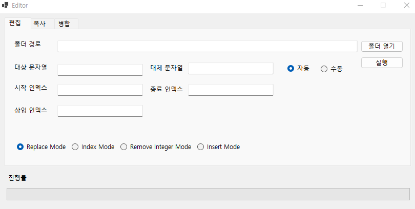
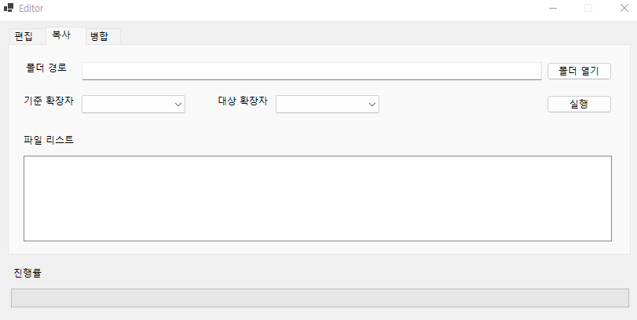
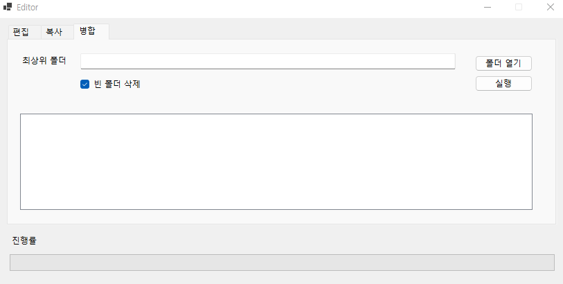

## File Rename Editor
* 많은 파일 이름을 일괄적으로 변경하기 위해 제작되었습니다.
  

## 기능(Function)
### 편집
* Replace Mode
  * 찾을려는 문자열을 대체 문자열로 교체합니다.
* Index Mode
  * 지정한 문자열의 범위의 문자열을 파일명으로 수정합니다.
* Remove Integer Mode
  * 파일명에 포함된 숫자를 제거합니다.
* Remove Integer Mode
  * 기존 파일명에 삽입할 문자열을 붙여 줍니다.

### 복사
* 기준 확장자의 파일 명 규칙을 대상 확장자의 파일에 적용합니다. 

### 병합
* 챕터별로 저장된 파일을 기본 분류 폴더로 이동합니다.

## 개발 환경(Develop Environment)
* Visual Studio 2022
* .NET 5
  
## 스냅샷(Snapshot)

